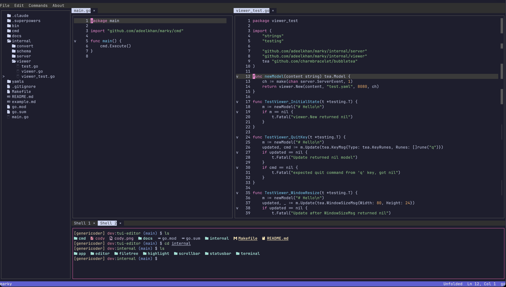

# Cody

A terminal-based code editor written in Go.



## Features

- **Project file tree** — lazy directory walker with icons (Nerd Font by default,
  plain Unicode fallback via `--no-nerd-font`); navigate with arrow keys or `hjkl`
- **Syntax highlighting** — tree-sitter-backed, supporting Go, Python, JavaScript,
  TypeScript, and Markdown; debounced re-highlight on edit
- **Code folding** — fold/unfold function bodies, block statements, and Markdown
  sections (`Ctrl+K`); search automatically unfolds a folded match
- **Incremental search** — `Ctrl+F` opens an in-buffer find dialog; case-insensitive
  substring matching, live match-jump as you type, `Enter`/`Shift+Enter` cycle
  next/previous, `Esc` closes
- **Embedded terminal** — real shell pane; full interactivity: `vim`, `htop`,
  `ssh`, `Ctrl+C`, etc.
- **Terminal tabs** — `Ctrl+T` opens a new, fully independent shell session as
  its own tab (own pty, own scrollback); click to switch, click a tab's `×` to
  close it
- **Split-view editor** — right-click a tab and choose "Split + Move Right" to
  open a second editor pane; each pane is independently editable, scrollable,
  and resizable, and tabs can be moved between panes from the same menu
- **Edit operations** — `Ctrl+X`/`Ctrl+C`/`Ctrl+V` cut/copy/paste (internal
  clipboard), `Ctrl+Z`/`Ctrl+Y` undo/redo, `Shift+Arrow` selection
- **Command palette** — click `Commands` in the menu bar (or use the palette
  shortcut) to search and run any registered command
- **File open dialog** — `Ctrl+O` to open a file by path (relative to project root
  or absolute)
- **Resizable panes** — drag the tree's right border to resize it, the boundary
  between the editor and terminal, or (once split) the boundary between the
  two editor panes
- **Status bar** — project name, most-recent command, cursor position, file type

## Build & run

Requires a C compiler (CGO) for tree-sitter grammar bindings.

```bash
make build                        # builds the cody binary (go build -o cody ./cmd/cody)
make test                         # runs the test suite (go test ./...)
./cody <path-to-project>          # opens the project tree at the given path
./cody                            # defaults to the current directory
./cody --no-nerd-font <path>      # plain Unicode icons (for terminals without Nerd Fonts)
```

## Keybindings

### Global (any pane)

| Key | Action |
|-----|--------|
| `Tab` / `Shift+Tab` | Cycle focus: tree → editor → terminal → tree (and reverse) |
| `Ctrl+N` | New blank ("Untitled") tab — `Ctrl+S` on it prompts for a save path |
| `Ctrl+O` | Open file by path |
| `Ctrl+F` | Find in current buffer |
| `Ctrl+T` | New terminal tab (starts its shell immediately) |
| `Ctrl+Q` | Quit (cleanly terminates every open shell; prompts if any tab has unsaved changes) |

Click and drag the tree pane's right border to resize it, the boundary
between the editor and terminal to resize the terminal, or (once the editor
is split) the boundary between the two editor panes to resize them relative
to each other. Every pane has a minimum size; when the window is large
enough to fit every open pane's minimum at once, the pane on the other side
of a drag always keeps enough room to stay usable (an aggressively
downsized window can still leave a pane below its own minimum — resize the
window back up to recover).

Any open dialog (Open, Find, palette, About, unsaved-changes confirmation,
New/Rename) can be dismissed with a left click anywhere, same as `Esc`.

### Project tree

| Key | Action |
|-----|--------|
| `↑`/`↓` or `j`/`k` | Move selection |
| `Enter` or `l` | Expand directory / open file (shifts focus to editor) |
| `h` | Collapse directory |
| `n` | Open the New File / New Folder / Rename menu for the selected item² |
| Right-click | Same menu, anchored at the clicked item (or the end of the listing, for empty space, for New only) |

Once the menu is open: `↑`/`↓` to move between items, `Enter` to pick one,
`Esc` to close. Picking New File/Folder or Rename shows an inline text field
in the tree — type the name and `Enter` to confirm, `Esc` to cancel.

### Editor

| Key | Action |
|-----|--------|
| Arrow keys | Move cursor |
| `Home` / `End` | Start / end of line |
| `Page Up` / `Page Down` | Scroll by page |
| `Shift+Arrow` | Extend selection¹ |
| `Ctrl+Left` / `Ctrl+Right` | Jump to previous / next word boundary |
| `Ctrl+Shift+Left` / `Ctrl+Shift+Right` | Extend selection by word¹ |
| `Backspace` / `Delete` | Delete character |
| `Enter` | Insert newline |
| `Ctrl+S` | Save file |
| `Ctrl+X` / `Ctrl+C` / `Ctrl+V` | Cut / Copy / Paste (internal clipboard) |
| `Ctrl+Z` / `Ctrl+Y` | Undo / Redo |
| `Ctrl+K` | Toggle code fold at cursor line |

### Editor tabs

| Action | Effect |
|--------|--------|
| Click a tab | Switch to it |
| Click a tab's `×` | Close it (prompts if it has unsaved changes) |
| Right-click a tab | Open a menu to move it into a split |

Right-clicking a tab in the left (or only) pane offers **Split + Move
Right**: opens a second editor pane and moves that tab into it. Each pane
keeps its own tab bar and is independently editable, scrollable, and
resizable. Right-clicking a tab in the right pane offers **Move Left** to
move it back — moving the split's last tab out of either pane collapses
back to a single pane.

### Find dialog (`Ctrl+F`)

| Key | Action |
|-----|--------|
| Type | Jump to nearest match (case-insensitive) |
| `Enter` | Next match |
| `Shift+Enter` | Previous match¹ |
| `Esc` | Close dialog and clear search highlight |

### Terminal pane

The terminal pane supports multiple independent tabs, each its own shell
session (own pty, own scrollback) — click a tab to switch to it, click its
`×` to close it. The terminal pane itself can't be closed: closing the last
remaining tab replaces it with a fresh session rather than closing the pane.
If the terminal pane already has focus at that point, the replacement
starts immediately, the same as `Ctrl+T`; otherwise it starts lazily, the
next time you focus it. `Ctrl+T` opens a new tab and starts its shell
immediately.

While the terminal pane has focus, keystrokes go directly to the shell.
`Ctrl+S`/`Ctrl+X`/`Ctrl+C`/`Ctrl+V`/`Ctrl+Z`/`Ctrl+Y`/`Ctrl+K`/`Ctrl+F` pass
through to the shell. Only `Ctrl+O`, `Ctrl+N`, `Ctrl+T`, and `Ctrl+Q` stay
global.

### Menu bar

Click `File` or `Edit` to open a dropdown; click an item to run it; `Esc` or
click elsewhere to close. Click `Commands` to open the command palette — type to
filter, arrows to select, `Enter` to run, `Esc` to close. Click `About` for
version info and the macOS shortcut note.

---

¹ Requires a terminal emulator that reports shift-modified keys as distinct escape
sequences (iTerm2, Alacritty, Kitty, WezTerm, and most other modern emulators).

² Some terminal emulators don't reliably forward right-click to the app (a
few report it as a left click at the wire-protocol level, which is outside
this app's control) — `n` always works regardless of terminal.

## macOS note

macOS terminal emulators intercept `Cmd+C`/`Cmd+V`/`Cmd+X`/`Cmd+Z` before they
reach any app running inside them. Use `Ctrl+` bindings — they work on every
platform. If you want `Cmd+` bindings, reconfigure your terminal emulator to
send the matching escape sequence.

## Terminal pane limitations

- Tab completion is unavailable — `Tab` / `Shift+Tab` are reserved globally for
  pane-focus cycling and never reach the shell.
- Arrow keys use normal cursor-key mode; full-screen programs that require
  application-mode arrows may see incorrect behavior (most `vim` / `less`
  configs work fine out of the box).
- The shell does not restart if it exits; the pane shows the last rendered frame.
- Abrupt process termination (e.g. `kill -9` on the parent) may leave the spawned
  shell orphaned. `Ctrl+Q` always cleans up correctly.
